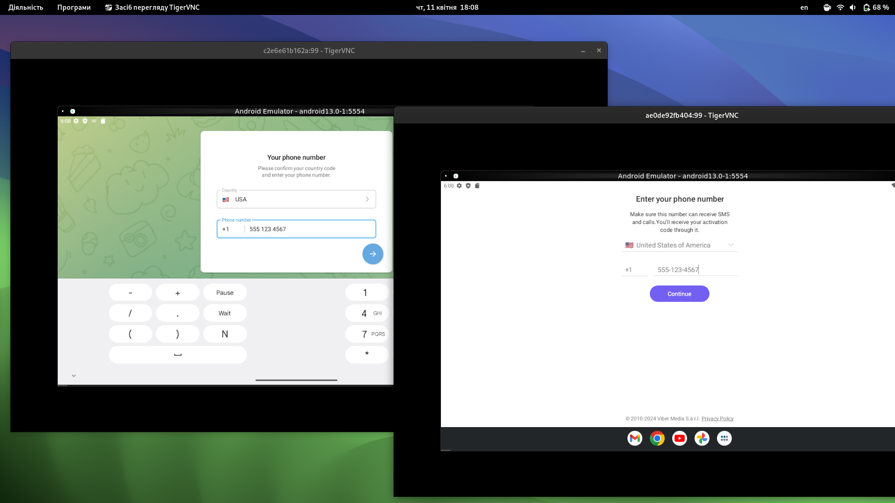

# FAST ANDROID EMULATOR
 - Android 13.0
 - Tablet view
 - Preistalled: adb

[](https://github.com/dzhunli/android_in_docker/actions/workflows/docker-image.yml)


---

---

## Why is this necessary?
 - easy way to run android on linux
 - safe because it's in a container and isolated from the rest of the system
 - makes it possible to use applications that require only mobile version for registration (Viber, WhatsApp)

## Requirements
1. You must have Linux
2. You must install some packages for the emulator to work 

tigervnc --> simply command for install
 ```bash
sudo apt update && sudo apt install -y -qqq tigervnc-viewer
```

docker --> please visit https://docs.docker.com/engine/install/ (you don`t need docker desktop ONLY docker engine)
## Install
- Using the command below, download the script for yourself
```bash
    curl -O https://raw.githubusercontent.com/dzhunli/android_in_docker/main/shell-emu | chmod +x ./shell-emu
```

- (OPTIONAL) Add the ability to run from anywhere 
 ```bash
    sudo mv shell-emu /usr/local/bin
```
## Usage
- Use this command to launch and manage the emulator 
 ```bash
    shell-emu -<flag>
```
---
| flag  | Description        |
|----------|--------------------|
| -r | Run & connect to android emulator |
| -d | Delete all android emulator containers |
| -h | Show help |

## Acknowledgements
Special thanks to the aerokube.com for their emulator, the approaches in which were taken as the basis for the project
